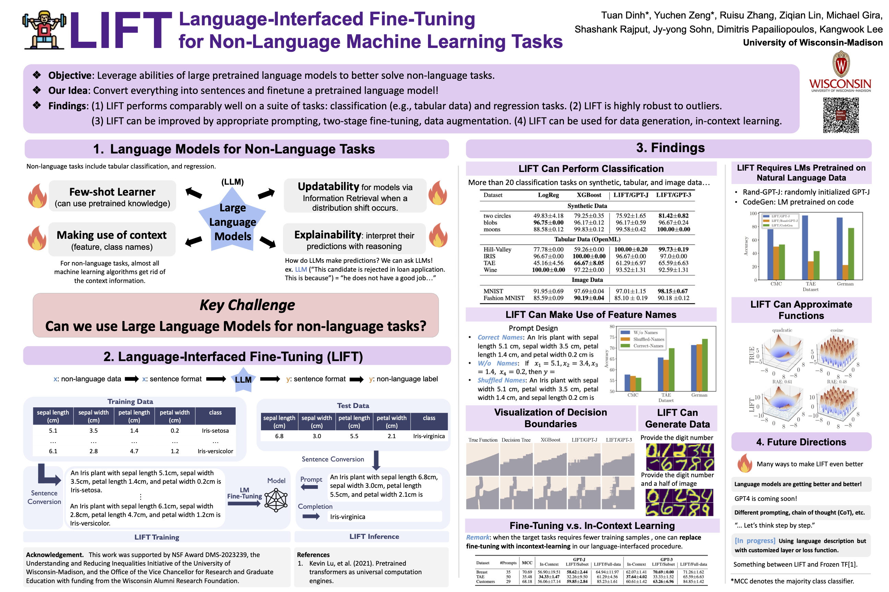

# LIFT: Language-Interfaced FineTuning for Non-Language Machine Learning Tasks

[Tuan Dinh](https://tuan-dinh.github.io/) *, [Yuchen Zeng](https://yzeng58.github.io/zyc_cv/) *, Ruisu Zhang, [Ziqian Lin](https://myhakureimu.github.io/), Michael Gira, [Shashank Rajput](https://pages.cs.wisc.edu/~srajput/), [Jy-yong Sohn](https://sites.google.com/view/jsohn), [Dimitris Papailiopoulos](https://papail.io/), [Kangwook Lee](https://kangwooklee.com/)

Advances in Neural Information Processing Systems 35 (NeurIPS 2022).

Links: [Paper](https://openreview.net/pdf?id=s_PJMEGIUfa), [Video](https://nips.cc/virtual/2022/poster/54500), [Website](https://uw-madison-lee-lab.github.io/LanguageInterfacedFineTuning/)



## Abstract

Finetuning pretrained language models (LMs) has become a norm for learning various downstream tasks. While it is feasible to finetune LMs for language downstream tasks without making any architectural changes, most existing finetuning approaches for non-language tasks rely on task-specific designs for input, output layers, and loss functions. A natural question arises – Can language model finetuning solve non-language downstream tasks without changing models’ architecture or loss function? To answer this question, we study the efficacy and limitations of Language-Interfaced FineTuning (LIFT) for non-language tasks by conducting an extensive empirical study on a suite of non-language classification and regression tasks. LIFT does not make any changes to the model architecture or loss function, and it solely relies on the natural language interface, truly enabling "no-code machine learning with language models". We find that LIFT performs relatively well across a wide range of low-dimensional classification and regression tasks, matching the performances of the best models in many cases, especially for the classification tasks. We thoroughly study fundamental properties of LIFT, including the inductive bias, sample efficiency, ability to extrapolate, robustness to noises and corrupted labels, and adversarial robustness. We also analyze a few unique properties specific to LIFT – non-deterministic predictions and how to use them, and sample-efficient context-aware learning via appropriate prompting or two-stage finetuning. We provide discussions on limitations and open questions toward making LIFT more effective and efficient.

## Misc
[](https://github.com/UW-Madison-Lee-Lab/LanguageInterfacedFineTuning/stargazers)

[](https://github.com/baaivision/Emu/network/members)

[](https://star-history.com/#UW-Madison-Lee-Lab/LanguageInterfacedFineTuning&Date)

## Repository layout

```
.
├── data/                     # Large reference artefacts and archived datasets
│   └── legacy/
├── docs/                     # Project documentation and media assets
│   └── assets/
├── scripts/                  # Shell entry points that orchestrate experiment batches
│   └── classification/
├── src/
│   └── lift/
│       ├── experiments/
│       │   ├── ablations/    # Follow-up studies such as ridge regression
│       │   ├── classification/
│       │   └── regression/
│       └── models/
│           └── gptj/
└── environment_lift.yml      # Conda environment with all dependencies
```

All Python modules live under `src/`. Setting `PYTHONPATH=$(pwd)/src` (or working inside a virtual environment that does it for you) ensures imports resolve correctly.

## Getting started

1. Create an environment from the provided specification or install the dependencies manually:

   ```bash
   conda env create -f environment_lift.yml
   conda activate lift
   ```

2. Export your OpenAI API key when running GPT-3 experiments:

   ```bash
   export OPENAI_API_KEY="<your key>"
   ```

3. Make sure `src/` is on the Python path. When using `conda` or `venv` you can add the following line to your shell profile:

   ```bash
   export PYTHONPATH="${PYTHONPATH}:$(pwd)/src"
   ```

## Running experiments

### Classification

The classification workflow lives in `lift.experiments.classification`. Core utilities such as dataset preparation and shared model helpers are exposed as modules under this package. Typical entry points are:

```bash
# Baseline classical models
python -m lift.experiments.classification.run_exps.run_baselines --help

# GPT-J experiments
python -m lift.experiments.classification.run_exps.run_gptj --help

# GPT-3 experiments (requires an OpenAI key)
python -m lift.experiments.classification.run_exps.run_gpt3 --help
```

Pre-generated datasets are stored under `src/lift/experiments/classification/data`. Additional helper scripts for running large batches reside in `scripts/classification/`.

### Regression

Regression experiments are available via `lift.experiments.regression`. You can reproduce the paper’s synthetic regression tasks with:

```bash
python -m lift.experiments.regression.utils.run_exp
```

Fine-tuning utilities for GPT-3 and GPT-J live in `lift.experiments.regression.utils`. Real-data experiments are collected under `lift.experiments.regression.realdata`.

Generated datasets and cached artefacts are written to the canonical directories declared in `lift.experiments.regression.utils.paths`, ensuring scripts operate relative to the repository root regardless of the current working directory.

### Ablation studies

Extended analyses (e.g. contradicting prompts or ridge regression) are housed in `lift.experiments.ablations`. These modules reuse the regression utilities and can be executed directly as modules:

```bash
python -m lift.experiments.ablations.contradictingPrompts.contradictingPrompts
```

## Data artefacts

Large binary artefacts that previously lived at the repository root now live under `data/legacy/`. The `classification_utils.bin` file is retained for reproducibility of historical experiments but is not loaded by default.
